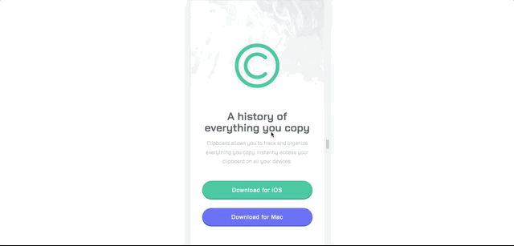

# Frontend Mentor - Clipboard landing page solution

This is a solution to the [Clipboard landing page challenge on Frontend Mentor](https://www.frontendmentor.io/challenges/clipboard-landing-page-5cc9bccd6c4c91111378ecb9). Frontend Mentor challenges help you improve your coding skills by building realistic projects. 

## Table of contents

- [Overview](#overview)
  - [The challenge](#the-challenge)
  - [Screenshot](#screenshot)
  - [Links](#links)
- [My process](#my-process)
  - [Built with](#built-with)
  - [What I learned](#what-i-learned)
  - [Continued development](#continued-development)
  - [Useful resources](#useful-resources)
- [Author](#author)

## Overview

### The challenge

Users should be able to:

- View the optimal layout for the site depending on their device's screen size
- See hover states for all interactive elements on the page

### Screenshot



### Links

- Solution URL: [Add solution URL here](https://your-solution-url.com)
- Live Site URL: [Add live site URL here](https://your-live-site-url.com)

## My process

### Built with

- Semantic HTML5 markup
- CSS custom properties
- Flexbox
- Mobile-first workflow

### What I learned

I've found a cool way of controlling the font size accordingly with the viewport ruling off the necessity of creating media queries using clamp(). The link to the article where I found the tool for creating the values is in the [useful resources](#useful-resources) section.

```css
.feature__tittle--l {
  font-size: clamp(1.875rem, 1.6329rem + 1.0329vw, 2.5625rem);
}
```

### Continued development

I need to study SASS or Tailwind CSS ASAP.

### Useful resources

- [Clamp()](https://css-tricks.com/linearly-scale-font-size-with-css-clamp-based-on-the-viewport/#for-those-who-dont-mind-that-edge-case) - This helped me turn text responsive without media queries.

## Author

- Website - [allfigueiredodev](https://github.com/allfigueiredodev)
- Frontend Mentor - [@allfigueiredodev](https://www.frontendmentor.io/profile/allfigueiredodev)
